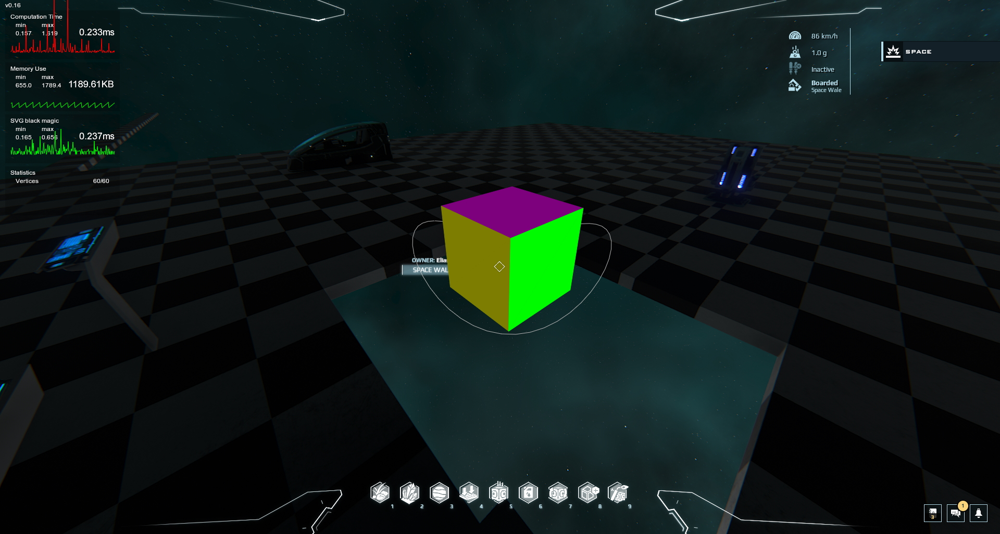

# DU 3D AR Engine
## What is this repo ?
An open-source project in the Dual Universe, to implement a 3D engine in Lua to be used in Augmented Reality in the game.
This is a work in progress.

### Reminder :  This is a work in progress, so there are obviously a lot of obvious optimisations and some work to do ^^'.

## Last screenshot

## Changelog
### v0.06 [02/10]
 - Implemented a first perspective projection engine in local construct referential
 - Added back-face culling with normal computations
 - Added metrics monitoring for debug purpose
 - Added some optimization to largely reduce operations count
 - Added past vertices computation reuse.
 - Added better depth sorting
### v0.10 [02/11]
 - Joined triangles, quad, lines ...etc in shapes
 - Added complete shapes depth sorting
 - Optimized computations
 - Reached > 2400 vertices on segmented lines
### v0.18 [02/14]
 - Various optimizations and improvements on calculations and rendering
 - Added pre-computation of transformations, view and projection matrix
 - Merged all shapes types.
 - Removed the statistics tracking to rework it later

## Next steps
 - More optimization
 - SVG optimization (try)

## Next applications test:
 - 3D bezier curve
 - 3D procédural mesh
