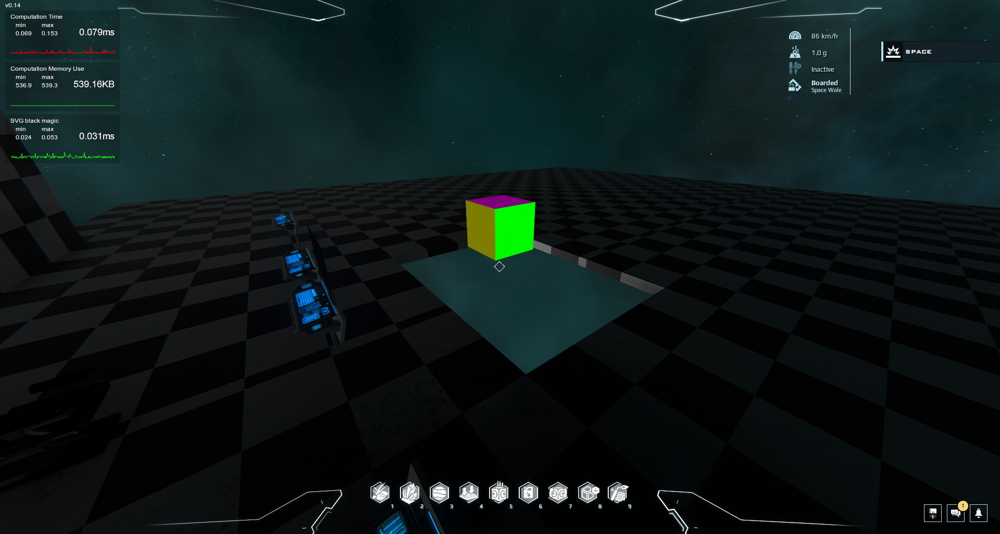

# DU 3D AR Engine
## What is this repo ?
An open-source project in the Dual Universe, to implement a 3D engine in Lua to be used in Augmented Reality in the game.
This is a work in progress.

### Reminder :  This is a work in progress, so there are obviously a lot of obvious optimisations and some work to do ^^'.

## Last screenshot

## Changes done 
 - Implemented a first perspective projection engine in local construct referential
 - Added back-face culling with normal computations
 - Added metrics monitoring for debug purpose
 - Added some optimization to largely reduce operations count
 - Added past vertices computation reuse.
 - Added better depth sorting
