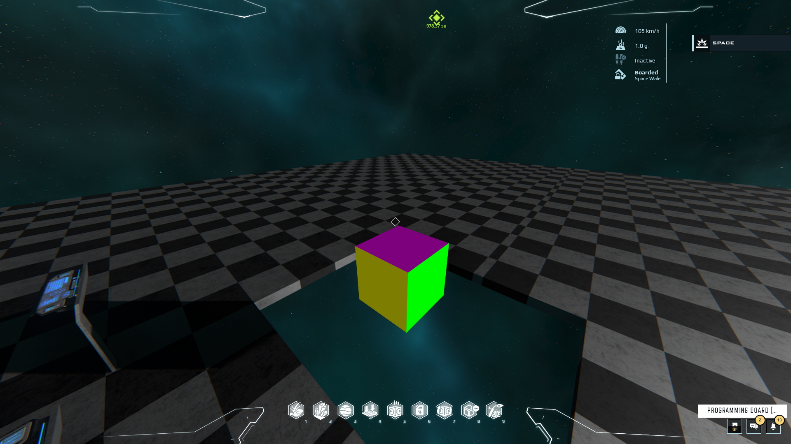

# DU 3D AR Engine
## What is this repo ?
An open-source project in Dual Universe, to implement a 3D engine in Lua destined to be used in Augmented Reality in the game.
It's work in progress.

## Last screenshot

## Changes done 
 - Implemented a first perspective projection engine in local construct referential
 - Added back-face culling with normal computations
